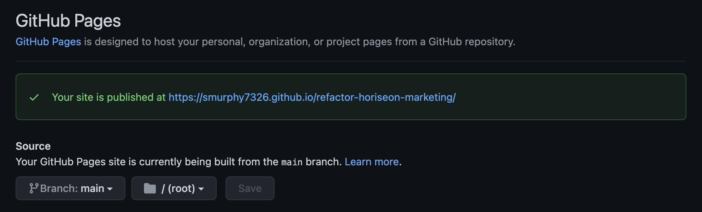
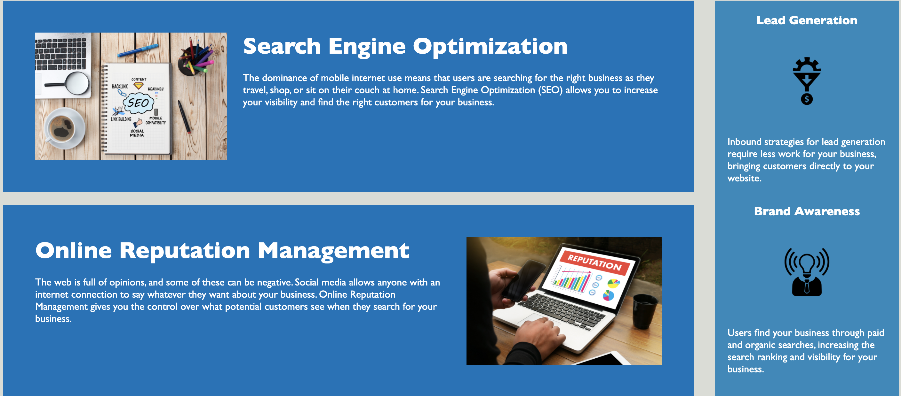
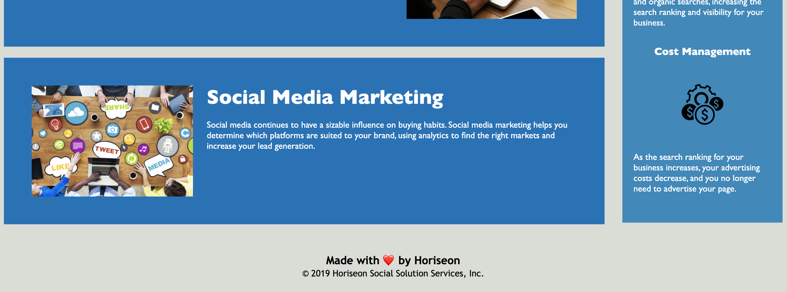

# UCONN Coding Bootcamp Module One Horiseon Marketing Code Refactor

## Purpose 

Horiseon asked the UCONN Coding Bootcamp to help reformat the code of their website to be able to meet the accessiablty standards their site wants to meet. They would like the standards to be optimized for different search engines. This can be accomplished by consolidating elements of the webpage and CSS elements, adding addtional attributes to make sure the site is readable, and improving the continuity of the webpage for when the webpage wants to be updated in the future. 

### Version 1 - first commit

### Version 1.1 - got rid of develop folder
* Got rid of the develop folder and got assets and index.html out to the front of the repository. 

### Version 1.2 - Notes for Index 
* When the Navigation Section began and ended
* Changed the div class to nav. class to indicate it was navigation in the webpage
* Where the Hero section beings and ends
* Changed div class “content” to services and updated in CSS at the same time. Because those are services that the company provides and not content. 
* Left notes in the index.html for the Services, Benefits and Footer sections. Where they began and ended.

### Version 1.3 - CSS Style Comments
* Added in a General, Header, Hero, Services, Benefits, and Footer notes where they begin and end
* Moved a and p along with the float-left and float right properties to the top of the page for general style

### Version 1.4 - Index Work Front Half
* Changed the title fo the webpage from website to “Horiseon” in the <head> section
* Added a title to the picture on the website when the curser is over it for a little bit 
* Changed the div class under services to div id to match the other two links, and be specific for this particular link
* Added a class note afterwards with “search-engine-optimization” Noticing the two other links worked with this code helped to change it. 

### Version 1.5 - Consolidating Services Section
* In Index.html - Changing in the services branch that the class will all be the same, so we can just have one style in the CSS page. Changed to - class =“services-info”
* Added in an alt after the class in the lines with ing src to get rid of the red line in the index.html, also if you want to name the pictures
* Went over to CSS and consolidated the information from “.search-engine-optimization”, “online-reputation-management”, and “.social-media-marketing” to go down to one- “.services-info”. 

### Version 1.6 - More Consolidating Services
* In index.html in the benefits section change the “div class=“ to “benefit-info” from “benefit-lead”, “benefit-brand”, and “benefit-cost” respectively.
* Also add alt=“” at the end of each of the pictures to get rid of the red line, also if you want to name them 
* In the style.css find “.search-engine-optimization img” “.online-reputation-management img” and .social-media-marketing img” and consolidate it to .services-info img” and bring it to the services section of the CSS
* The h2 elements if the services section that we changed must also be consolidated. Take them and only keep on and rename it “services-info h2”, and bring it up to the services section

### Version 1.7 - Consolidating Benefits Section
* Consolidate the benefit section in CSS by taking the “.benefit-lead”, “.benefit-brand”, and “.benefit-cost” to “benefit-info” and keep one of them.
* Take the h3 for the benefits section and keep one and change to “.benefit-info h3”
* Take the img for the benefits section and keep one and change to “.benefit-info img”
* Move “services-info h2” to the services section

### Version 1.8 - Link Working
* Under the services section, “div div” must be changed to div id for the link to work.

### Version 1.9 - Changed Footer Note Location
* Moved the footer note in the index.html to the proper place

### Version 1.10 - README.md file
* Editted README.md file

### Version 1.11 - README.md tinkering
* Adjusted the README.md file to look more streamline

### Version 2 - h4 and text after alt
* Changed the footer header to h4
* Added text after the alt in the services section to describe the photos

### Verison 2.1 - added jpg for README
* Changed some div tags to have the code read better
* Added Screenshots to the README.md

### Version 2.2 - trying out picture
* Tried to get a picture in the README

### Version 2.3 - changing names in images
* Changed the names in images

### Version 2.4 - pictures working
* Making sure the pictures work

### Version 2.5 - pictures all working

* Corrected errors for the pictures 
* Added a new change for the Part 3 in README

